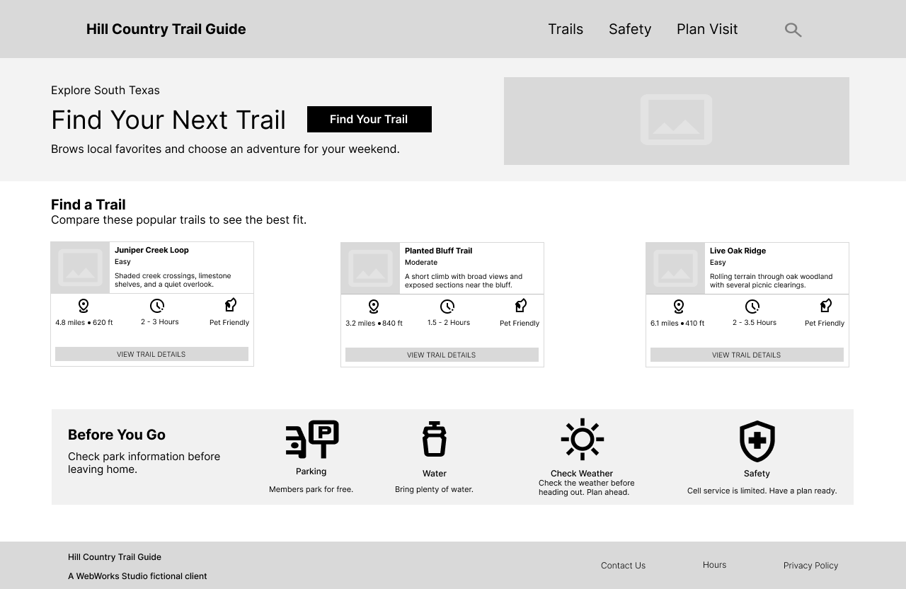

# Week 7 — Wireframes & Prototype Handoff

## Hill Country Trail Guide

**Primary User:** Maya Torres  
**Primary Task:** Choose a beginner-appropriate Saturday hike that can be completed in about three hours or less.

---

## 1. Project Overview

Briefly summarize the Week 6 problem you are carrying forward.

Fixed the Week 6 problems of difficulty reading the labels and none-descriptive info on trails and such.

---

## 2. Three Design Requirements

Translate your **top three Week 6 priorities** into exactly three interface requirements.

### Requirement 1

**Week 6 problem:** Labels Aren’t Explained.
**Design requirement:** Make it easy to identify which trail suits a beginner like Maya.
**How this helps Maya:** By seeing the trail info right away, Maya can quickly identify which trail best suits her.

### Requirement 2

**Week 6 problem:** No Estimated Hiking Time.
**Design requirement:** Make the estimated hiking times easy to identify so Maya can see which trails she would like and can complete.
**How this helps Maya:** By seeing how long the trail she chose will take, Maya can plan her hiking trip. She can plan how much water or food to take based on the estimated time.

### Requirement 3

**Week 6 problem:** Dog Rules, Fees, and Access Are Unclear.
**Design requirement:** Make it clear whether dogs are allowed on the trails, whether you have to pay a fee for them, and whether that changes within certain days/hours.
**How this helps Maya:** Instead of searching the whole website and clicking through and scanning every piece of information to see whether dogs are allowed, which could discourage her from even going on the trail, she can quickly see whether dogs are allowed. By easily finding the info she needs, she’ll feel more comfortable and prepared to plan the hiking trip.

---

## 3. Figma Prototype Link

## https://www.figma.com/proto/lttpEL5iZX0S1Oyr52ZQHC/Hill-Country-Trail-Guide-Wireframe?node-id=2-2&t=qlZXj5pAXzv50dmy-1&scaling=scale-down&content-scaling=fixed&page-id=0%3A1&starting-point-node-id=2%3A2&show-proto-sidebar=1

## 4. Required Wireframe Exports

1. 
2. 
3. 
4. 

---

## 5. Prototype Flow

Describe the user task your prototype demonstrates.

**Starting point:** On the home page, clicking on the “VIEW TRAIL DETAILS” button on Juniper Creek Loop.
**User action:** Clicking on the “VIEW TRAIL DETAILS” button.
**System/interface response:** Redirects you to a new page.
**End state:** Landing on a new page that goes more into detail about the trail you clicked on.

---

## 6. Design Rationale

Document approximately three important decisions.

### Decision 1

**Problem:** Maya couldn’t tell whether a trail was at her level of experience.
**Design response:** Clearly labeled each of the trails' difficulty with the rest of the info.
**Why:** Maya is a beginner and not familiar with hiking terms, so it should be clearly stated for comparing options.

### Decision 2

**Problem:** No clear time on how long a trail is.
**Design response:** Estimated completion time is included with the rest of the hiking info.
**Why:** One of Maya’s criteria is finding out how long a hike can take, so it should be clearly stated so she can compare trails.

### Decision 3

**Problem:** Unclear whether dogs are allowed, and any fees to pay.
**Design response:** Included info on whether dogs are allowed on trails, and that parking is only free for members.
**Why:** Maya’s criteria also includes whether dogs are allowed, and understanding parking and fees. So I made it visible for her to easily understand.

---

## 7. Accessibility Notes

Document at least two accessibility decisions you planned before development.

### Accessibility Decision 1

Made sure content is easily understood, such as text written using plain language.

### Accessibility Decision 2

Made sure all clickable or interactive elements are sized to allow users to easily activate them.

---

## Week 8 Handoff

In Week 8, the client moves into a common production starter. You will implement two JavaScript behaviors connected to Maya's needs:

1. an accessible explanation/disclosure for trail difficulty; and
2. form validation and user feedback for a hike-planning form.

Your Week 7 prototype may explore these or another related solution. The important continuity is the user need and interaction reasoning.
